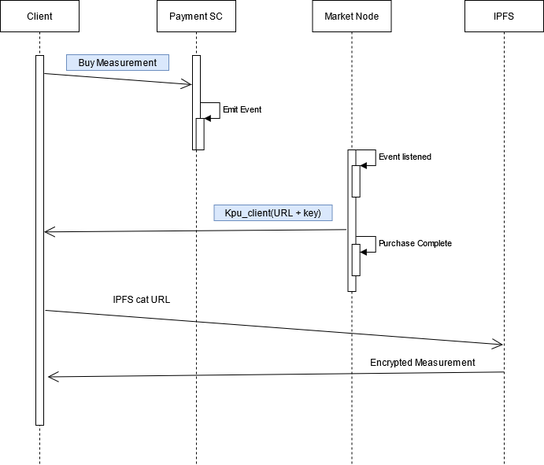

<h1>Blockchain Marketplace</h1>
This is a Blockchain based platform that enables the purchase of IoT measurements directly from the IoT suppliers in an easy and transparent way. IoT provider can use this platform to publish their measurements, so clients can purchase them. The inherent properties of Blockchain technology allows the recording of every action produced within the platform. Thus, ensuring transparency.

This platform aims to achieve the following key points:
<li>Guarantee that customers purchase measurements.</li>
<li>Guarantee the delivery of the measurements to those clients who purchased them.</li>
<li>Guarantee the reliabilty of the measurements provided by the IoT suppliers.</li>

<h2>Architecure</h2>
In this <a href="#gen-arch">figure</a> you can see the general architecture of the system. The core of the platform is the Blockchain. This element is an Ethereum Blockchan that uses Clique as consensus model. Inside the Blockchain there are four smart contracts running on it.

<ul><a href="./storage/contracts/dataContract/data.sol">Data SC</a>: Stores the encrypted URL where the measurement is located in the Blockchain, so it is available to be purchased. In addition to the URL,  this contract also stores the symmetric key, encrypted with the public key of the administrator of the platform,  to decipher the value of the measurement </ul>
<ul><a href="./storage/contracts/accessContract/accessContract.sol">Access Control SC</a>: Controls the users who can introduce measurements in the Blockchain. Only those IoT suppliers approved by the administrator of the platform can insert new content in the platform. Moreover, this SC stores the public keys of the customers that participates in the platform.</ul>
<ul><a href="./storage/contracts/balanceContract/balance.sol">Payment SC</a>: Manages the purchases of the clients. It guarantees that a measurement has been bought by a client</ul>
<ul><a href="./storage/contracts/balanceContract/ERC20.sol">ERC20 SC</a>: Defines the Token that will be used in the platform and enables its exchange between customers and IoT suppliers.</ul>

These are ruled by the administrator of the platform. This user is responsible for adding or/and removing new IoT producers to the platform, delivering the measurements purchased by customers and configuring the parameters of the smart contract (i.e. total amount of tokens).

Besides the Blockchain, several elements participate within the platform. One of these components is the IoT connector. This is a proxy between the IoT gateway and the platform. It encrypts the measurements with a random symmetric key and stores them in the IPFS network, then it stores all the information needed to retrieve the measurements in the Blockchain. Specifically, it stores the IPFS URL and the symmetric key encrypted with the public key of the administrator of the platform., it stores the IPFS URL and the symmetric key encrypted with the public key of the administrator of the platform.

To store the value of the measurements, the platform uses a private IPFS network. Each of the IoT suppliers and the marketplace has an IPFS node that they can use to store the value of the measurements. This node is protected with an authentication module that controls who inserts information in the network. To do so, it uses the Blockchain, in particular the Access SC, to check whether the IoT provider has access to the IPFS network or not. Besides the IoT IPFS nodes, the marketplace has its own IPFS node to retrieve the value of the measurements.

The marketplace is in charge of listening to the purchase events produced in the Blockchain whenever a client buys a measurement. Once this component listens to an event, it retrieves the complete value of the acquired measurement from the IPFS storage and deciphers the symmetric key stored in the Data SC with its private key. Then, it encrypts the symmetric key with the public key of the client who made the purchase and sends the encrypted measurement plus the encrypted symmetric key to the client. The customer only has to decipher the symmetric key with its private key and use it to decrypt the value of the measurement. 

Customers can use a webserver (Clients Wallet) to browse and purchase the different measurements available in the platform. Through this component, clients can purchase measurements and see their value easily. 

  
  
General architecture of the platform

<h2 id="marketplace">Marketplace overview</h2>
The marketplace is responsible of ruling the smart contracts running in the Blockchain. It is in charge of processing the purchasing requests of customers. It has to guarantee that the exchange of information between IoT providers and customers has been carried out successfully.

This component uses its own IPFS node to retrieve the value of the measurements from the IPFS network.

Funcionalities:
<li>Register IoT suppliers in the platform so they can sell measurements. To do this, it assigns Ethereum accounts to IoT suppliers and register them in the access control smart contract.</li>
<li>Listens the purchasing request events produced within the Blockchain and process them. This component is always listening the interactions within the Blockchain.</li>
<li>Acts as an access point for the administrator of the platform. From this component, he can change remove measurements from the platform or revoke transactions.</li>

The following figure shows the how the marketplace processes customers' purchases.

  
  
Processing of purchases

In the previous figure, the delivery of the purchased measurements to clients are carried out through the Blockchain. This is doing by sending the IPFS URL and the symmetric encryption key within a Blockchain transaction. Both fields are encrypted with the public key of the customer who made the purchases. Thus, assuring that only that customer can obtain the value of the measurement. Furthermore, we also guarantee the delivery of the measurement to the appropriate customer because the transaction is registered in the Blockchain.

<h2>Components involved</h2>
<li><strong><a href="#marketplace">Marketplace</a></strong></li>
<li><strong><a href="https://github.com/igonzaleztak/IoT-proxy">IoT Connector</a></strong></li>
<li><strong><a href="">Client interface</a></strong></li>